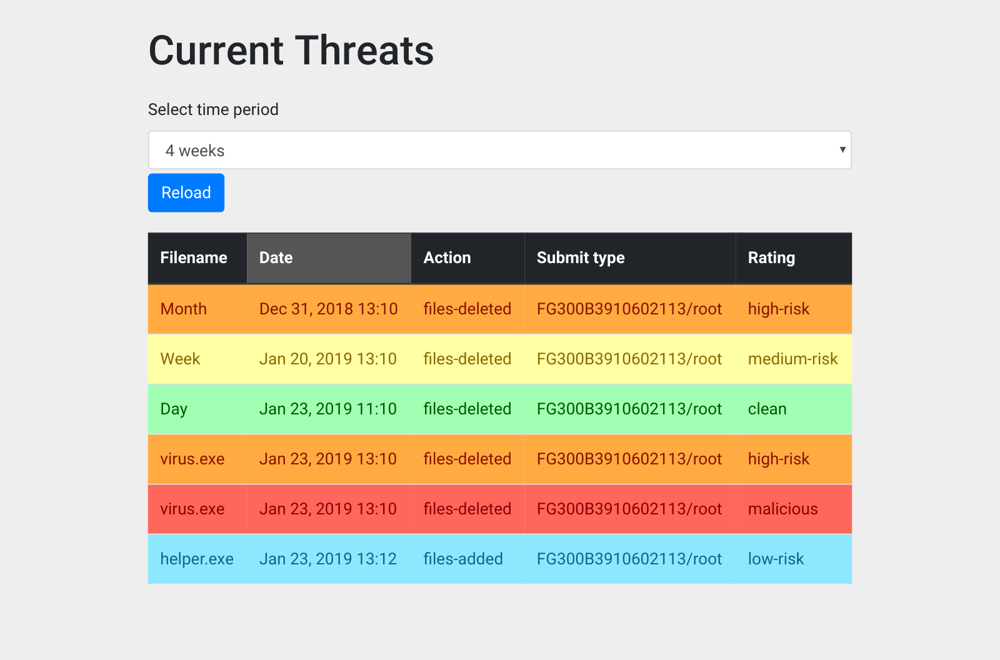

# threat-monitor

The a program that reads "threat" meta files and renders them in a table using Ajax. Each record in the table includes all fields of the meta file. Each row color-coded based on the record's threat level (rating). The table allows sorting.



## Sample Metafile Record:

```json
[
  {
    "date": "Jan 1, 2015 13:10:59",
    "filename": "virus.exe",
    "action": "files-deleted",
    "submit-type": "FG300B3910602113/root",
    "rating": "high-risk"
  },
  {
    "date": "Jan 1, 2015 13:12:59",
    "filename": "helper.exe",
    "action": "files-added",
    "submit-type": "FG300B3910602113/root",
    "rating": "low-risk"
  }
]
```

Rating Levels:

1. Clean
2. Low-Risk
3. Medium-Risk
4. High-Risk
5. Malicious

Implemented with Python within the Django framework, Javascript/JQuery and CSS/HTML.

To test program, sample meta-files can be droped into a base directory (example files are data.json and data1.json).

Run in from within base directory to start development server

```
python3 manage.py runserver
```

Each file is a list of JSON records in no particular order. These records will be rendered into a table in the front-end. This table allows for sorting of all fields and will also include a time-period dropdown (24-hours/7 days/4 weeks) for viewing records based on a given time-period.

## Future improvements

If a new record is detected and should be included in the table based on its state (time-period), an alert should be presented to the user informing them to reload the table.
